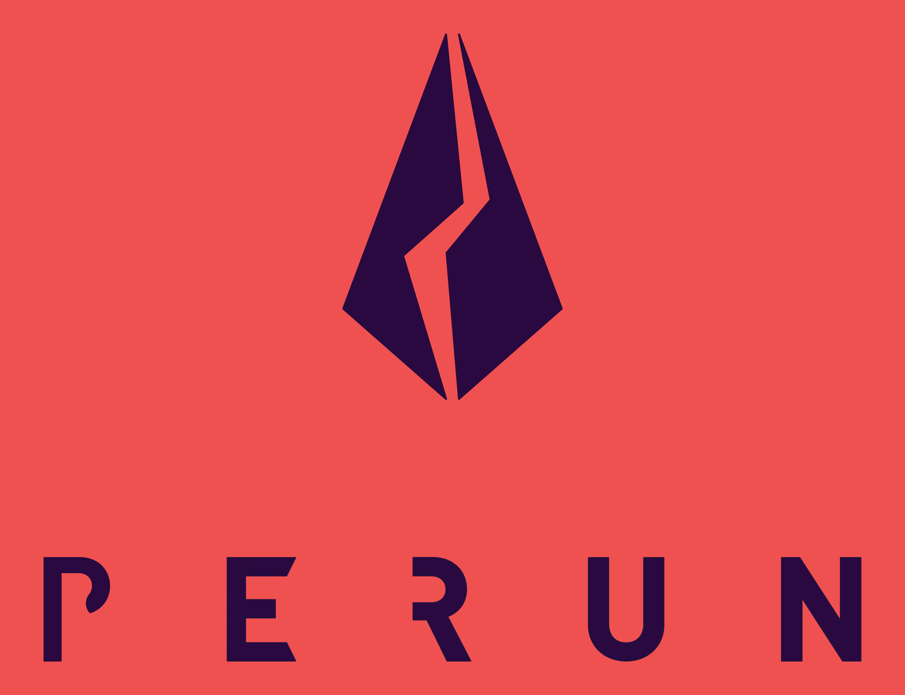

<h1 align="center"><br>
    <a href="https://perun.network/"></a>
<br></h1>

<h2 align="center">Perun Soroban Contract </h2>

<p align="center">
  <a href="https://www.apache.org/licenses/LICENSE-2.0.txt"></a>
</p>

# [Perun](https://perun.network/) Soroban Contract

This repository contains the contract that realizes Perun channels for the
[Soroban](https://soroban.stellar.org/docs) smart contract platform:

Build contract:

``` sh
cargo build
```

Run tests:

``` sh
cargo test
```